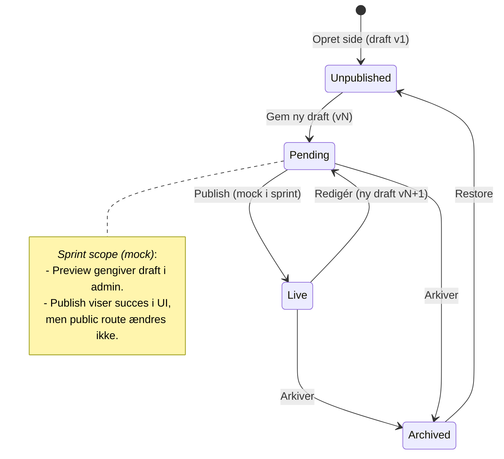

# Arkitektur og Teknologi – CMS POC (US-03)

> **Revision:** Opdateret 2025-09-18 10:55 for at matche ny kravspecifikation (**MAR-03-UC01**, **MAR-03-UC02**). I dette sprint implementeres **mockup** af *preview/publish*; egentlig public visning afhænger af **VIS-01-UC…**.

## Valg af Teknologi
- **Backend:** ASP.NET Core (Razor Pages), server-renderet HTML.
- **Database:** PostgreSQL med `jsonb` til fleksibel lagring (components, page versions).
- **Database-princip:** *Database-first* med **stored procedures** og **views**; datakonsistens og statusberegning håndteres i DB.
- **ORM:** EF Core (mapper til SP/Views).
- **Filhåndtering:** Lokalt filsystem i POC, abstraktion for senere **MinIO/S3**.
- **Billedbehandling:** SixLabors **ImageSharp** (resize, crop, WebP/AVIF).
- **Auth/roller:** ASP.NET Identity (roller: **Admin**, **Marketing**).
- **UI:** Razor + TagHelpers/Partial Views; semantisk HTML5; let CSS.
- **Deployment:** Container + Nginx reverse proxy. Blue/Green klargjort (ikke scope i sprintet).

---

## Arkitektur (oversigt)
- **Pages** har *draft*- og *published*-pegepinde til **page_versions**.
- **Status** beregnes i **DB view** (`page_status_v`) ud fra `draft_version_id`, `published_version_id`, `archived_at`:
  - `UNPUBLISHED` – aldrig udgivet
  - `PENDING` – draft ≠ published
  - `LIVE` – draft = published
  - `ARCHIVED` – arkiveret
- **PageVersions** rummer indhold: `template_key`, `sections jsonb`, `meta jsonb`.
- **Components** har metadata (tabel) + indhold i `sections jsonb` pr. version.
- **Mock scope (Sprint):** *Preview* og *Publish* udføres som UI-flow med persist af draft-version, men **uden** at påvirke public routing (**/p/{slug}**) endnu.

---

## Routing og Skærmbilleder
- **/admin**
  - Dashboard med liste over sider + status-badges fra `page_status_v`.
- **/admin/pages**
  - Liste, Opret/Rediger/Slet side (vælg template, tilføj komponenter).
  - **Preview (mock):** `/admin/pages/{id}/preview` – viser **draft**-render i admin-layout (badge: “Preview – Mock”). Ingen public cache/route.
  - **Publish (mock):** POST `/admin/pages/{id}/publish-mock` – UI viser succes-toast og markerer status “Live (Mock)”; DB opdaterer **ikke** `published_version_id` i dette sprint.
- **/admin/media**
  - Upload (drag-drop), liste, redigér `alt/title/tags`, se autogenererede varianter.

Skærmbilleder (wireframes – kort):
- **Pages/List:** Tabel: Title, Slug, Status, Actions (Edit, Preview (mock), Publish (mock)).
- **Pages/Edit:** Form: Title, Slug, Template (select), Components (sortable liste), Save Draft, Preview (mock), Publish (mock).
- **Media/List:** Grid + søg/filter; klik ind for metadata.

---

## Billedpipeline
1. **Upload** → Gem original: `/media/original/{uuid}.{ext}`
2. **Generér varianter** (thumb, 2x, webp/avif) via ImageSharp.
3. **Persistér metadata** i `media.variants` (jsonb): sti, dim, mime.
4. **Returnér** `mediaId` til komponenter.

> *Note:* Variants genereres synkront i POC; kan senere flyttes til baggrundsjob.

---

## Page Pipeline (med mock-stadier)

- **Unpublished:** Oprettet, aldrig publiceret.
- **Pending:** Draft ≠ Published (ændringer klar).
- **Live:** Draft = Published (bliver først ægte når VIS-01-UC… er implementeret).
- **Archived:** Ikke aktiv; kræver restore.

---

## Acceptance Criteria (tilpasset MAR-03-UC01, MAR-03-UC02)

### MAR-03-UC01 – Mediahåndtering (upload/administration af billeder)
- Marketing kan **uploade** JPG/PNG/WebP (filstørrelses- og mime-validering).
- Systemet **genererer varianter** (thumb, 2x, webp/avif) automatisk.
- Marketing kan **søge og redigere metadata** (alt, title, tags).
- Komponenter kan **vælge billede** via media-picker og gemme reference (`mediaId`).

### MAR-03-UC02 – Sideadministration (templates + komponenter) + Preview/Publish (mock)
- Marketing kan **oprette/redigere/slette** sider.
- Marketing kan **vælge template**; kun **tilladte komponenter** pr. template kan tilføjes.
- Komponenter understøtter mindst: **image**, **text (plain)**, **rich_text** (server-sanitized).
- **Preview (mock):** Marketing kan se en **render af draft** i admin uden at påvirke public.
- **Publish (mock):** Marketing kan aktivere en **simuleret publicering** (UI-feedback, statusbadge), **uden** at ændre `published_version_id` eller offentlig visning.
- Side-liste viser **status** fra DB-view (`UNPUBLISHED`, `PENDING`, `LIVE`, `ARCHIVED`).

> **Out-of-scope i sprintet:** Offentlig visning `/p/{slug}`, faktisk opdatering af `published_version_id`, SEO/meta-output, caching/ESI.

---

## Noter om DB-ansvar (views & SP)
- **`page_status_v` (view):** Udlæser `page_id`, `slug`, `title`, `state` beregnet ud fra pointere og `archived_at`.
- **SP – `save_draft(page_id, payload)`**: Opretter ny `page_versions`-række, opdaterer `draft_version_id`, returnerer `version_no`.
- **SP – `mock_publish(page_id)`**: No-op i DB for sprintet (kan logge event); UI opdateres klient-side.
- **SP – `archive_page(page_id)`**: Sætter `archived_at` (og evt. disable edit).

---

## Sikkerhed og kvalitet (POC)
- CSRF på formularer; role-based adgang (Marketing/Admin).
- Server-side validering + HTML-sanitization for `rich_text`.
- Billed-mime/dimension checks; begræns filstørrelse.
- Semantisk HTML5; alt-tekster på billeder.
- Performance: billeder leveres i moderne formater hvor muligt.

---

## Afhængigheder og fremtid
- **Afhænger af:** VIS-01-UC… for public rendering og SEO.
- **Næste iteration:** Ægte publish (sæt `published_version_id = draft_version_id`), public route, redirects ved slug-ændringer, søgning, designmanual enforcement, planlagt publicering.
