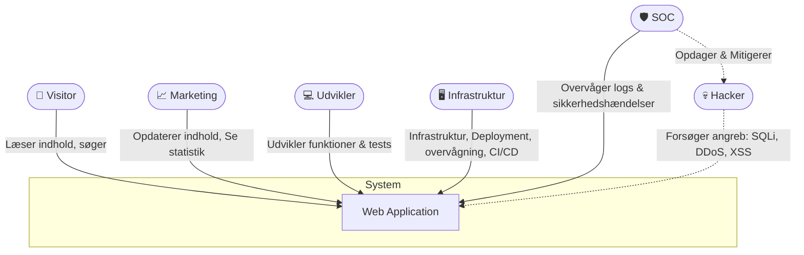

# Kravspecifikation – Læringsprojekt: Web Application i Produktionsmiljø

## Problemformulering
Hvordan kan man sætte en simpel hjemmeside i drift i et miljø, der ligner et produktionsmiljø, og samtidig sikre at både udvikling, infrastruktur og cybersikkerhed spiller sammen?
Løsningen skal give elever på hovedforløb 1 i datateknikeruddannelsen mulighed for at arbejde praktisk med deres respektive specialer (infrastruktur, programmering og cybersikkerhed) i et fælles projekt.

## Formål
Formålet er at give eleverne en realistisk øvelse, hvor de oplever:
- hvordan en simpel hjemmeside kan blive til et driftklart system,
- hvordan krav og tekniske valg dokumenteres og spores,
- hvordan man kan arbejde tværfagligt med udvikling, drift og sikkerhed,
- hvordan man implementerer funktionelle og ikke-funktionelle krav i praksis.

Projektet træner samarbejde, dokumentation, deployment, overvågning og sikkerhed, med fokus på at bygge en løsning, der ligner en professionel produktionsopsætning – men på et niveau, der er tilgængeligt for elever på H1.

## Kort beskrivelse af systemet
Systemet er en simpel hjemmeside, der:
- indeholder statiske sider med indhold,
- har en enkel søgefunktion,
- kan opdateres med nyt indhold af Marketing,
- understøtter logging, overvågning, backup og sikkerhedsbeskyttelse.

Systemet skal:
- kunne deployes med zero downtime,
- være optimeret til Core Web Vitals,
- have alle relevante sikkerhedsheaders,
- opnå 100 i alle Lighthouse-kategorier.

## Aktører

## User Stories, Use Cases og Krav

### 👤 Visitor - Se indhold (US-01)
**Som Visitor vil jeg kunne læse indhold på hjemmesiden, så jeg kan finde de informationer jeg har brug for.**

#### Use Cases
- **VIS-01-UC01 – Åbne forside**
  - **Aktør:** Visitor
  - **Forudsætning:** Domænet er aktivt; websitet kører; netværk er tilgængeligt.
  - **Trigger/Mål:** Læse forsiden.
  - **Hovedforløb:** 1) Visitor åbner forsiden i browseren. 2) Systemet returnerer HTML, CSS og nødvendige assets. 3) Forside-indhold vises og kan læses/scrolles.
  - **Udvidelser/Fejl:** a) Side findes ikke → 404-side vises. b) Assets fejler → siden vises med graceful degradation.
- **VIS-01-UC02 – Navigere til underside**
  - **Aktør:** Visitor
  - **Forudsætning:** Menu og links er konfigureret.
  - **Trigger/Mål:** Finde og læse en underside.
  - **Hovedforløb:** 1) Visitor klikker på et menupunkt/link. 2) Systemet serverer undersiden. 3) Indholdet vises og kan læses.
  - **Udvidelser/Fejl:** a) Dødt link → 404-side vises. b) Siden kræver ikke-login og vises uden sporbar personlig data.

#### Funktionelle krav
- **VIS-01-FK-001:** Systemet skal præsentere en forside med indhold (tekst og billeder). (dækker: VIS-01-UC01)
- **VIS-01-FK-002:** Systemet skal understøtte navigering til undersider via menupunkter. (dækker: VIS-01-UC02)
- **VIS-01-FK-003:** Systemet skal returnere en brugervenlig 404-side, hvis indhold ikke findes. (dækker: VIS-01-UC02)

#### Ikke-funktionelle krav
- **VIS-01-NF-004:** Hjemmesiden skal overholde en designmanual, der beskriver det grafiske design (farver, fonte, layout og billedstil). (dækker: VIS-01-UC01, VIS-01-UC02)
- **VIS-01-NF-005:** Siderne skal benytte semantisk HTML5 (fx \<header\>, \<nav\>, \<main\>, \<article\>, \<section\>, \<footer\>) for tilgængelighed og SEO. (dækker: VIS-01-UC01, VIS-01-UC02)
- **VIS-01-NF-006:** Forsiden skal loade på under 1 sekund ved normal belastning. (dækker: VIS-01-UC01)
- **VIS-01-NF-007:** Alt indhold skal være tilgængeligt med gyldig HTML og CSS (WCAG + W3C-valideret). (dækker: VIS-01-UC01, VIS-01-UC02)
- **VIS-01-NF-008:** Core Web Vitals (LCP, CLS, FID) skal ligge inden for Google’s “Good” threshold. (dækker: VIS-01-UC01, VIS-01-UC02)
- **VIS-01-NF-009:** Hjemmesiden skal kun være tilgængelig via HTTPS. (dækker: VIS-01-UC01, VIS-01-UC02)
- **VIS-01-NF-010:** Hjemmesiden skal opnå en Lighthouse score på 100 i alle kategorier (Performance, Accessibility, Best Practices, SEO). (dækker: VIS-01-UC01, VIS-01-UC02)

---

### 👤 Visitor – Søg på sitet (US-02)
**Som Visitor vil jeg kunne søge på hjemmesiden, så jeg hurtigt kan finde relevant indhold.**

#### Use Cases
- **VIS-02-UC01 – Foretage søgning med resultater**
  - **Aktør:** Visitor
  - **Forudsætning:** Indeksering af indhold er gennemført.
  - **Trigger/Mål:** Finde relevant side via søgning.
  - **Hovedforløb:** 1) Visitor indtaster søgetekst og trykker søg. 2) Systemet matcher forespørgsel mod indekset. 3) En rangordnet liste af resultater vises.
  - **Udvidelser/Fejl:** a) Resultater <n> vises pagineret. b) Specialtegn i søgefelt håndteres sikkert.
- **VIS-02-UC02 – Foretage søgning uden resultater**
  - **Aktør:** Visitor
  - **Forudsætning:** Indeksering af indhold er gennemført.
  - **Trigger/Mål:** Forstå at intet blev fundet og få forslag.
  - **Hovedforløb:** 1) Visitor indtaster søgetekst. 2) Systemet matcher uden fund. 3) Tom-resultat vises med forslag til næste skridt.
  - **Udvidelser/Fejl:** a) Staveforslag vises (hvis tilgængeligt). b) Ingen lækker af interne fejl i UI.

#### Funktionelle krav
- **VIS-02-FK-011:** Systemet skal tilbyde et søgefelt på hjemmesiden. (dækker: VIS-02-UC01, VIS-02-UC02)
- **VIS-02-FK-012:** Systemet skal kunne returnere en liste med relevante søgeresultater baseret på indhold. (dækker: VIS-02-UC01, VIS-02-UC02)
- **VIS-02-FK-013:** Systemet skal give feedback, hvis søgningen ikke giver resultater. (dækker: VIS-02-UC01, VIS-02-UC02)

#### Ikke-funktionelle krav
- **VIS-02-NF-014:** Søgefunktionen skal returnere resultater på under 2 sekunder. (dækker: VIS-02-UC01, VIS-02-UC02)
- **VIS-02-NF-015:** Søgeresultater skal rangordnes efter relevans. (dækker: VIS-02-UC01, VIS-02-UC02)
- **VIS-02-NF-016:** Søgefunktionen må ikke afsløre interne fejl (fx SQL-fejl) i brugerfladen. (dækker: VIS-02-UC01, VIS-02-UC02)
- **VIS-02-NF-017:** Søgefunktionen skal være tilgængelig via HTTPS. (dækker: VIS-02-UC01, VIS-02-UC02)
- **VIS-02-NF-018:** Søgeresultat-siden skal bidrage til en samlet Lighthouse score på 100 i alle kategorier. (dækker: VIS-02-UC01, VIS-02-UC02)

---

### 📈 Marketing – Opdatere indhold (US-03)
**Som Marketing-medarbejder vil jeg kunne opdatere indhold på hjemmesiden, så kampagner og information altid er aktuelle.**

#### Use Cases
- **MAR-03-UC01 – Uploade billeder**
  - **Aktør:** Marketing
  - **Forudsætning:** Marketing er logget ind i redigeringsværktøjet; filpolitik er defineret (type/størrelse/dimensioner).
  - **Trigger/Mål:** Tilføje et billede til brug i indhold.
  - **Hovedforløb:** 1) Marketing vælger 'Upload billede'. 2) Systemet validerer filtype og størrelse. 3) Systemet gemmer billedet og viser en URL/preview.
  - **Udvidelser/Fejl:** a) Fil for stor/ulovlig type → afvisning med regelbesked. b) Netværksfejl → upload kan genoptages.
- **MAR-03-UC02 – Tilføje, redigere og slette indhold**
  - **Aktør:** Marketing
  - **Forudsætning:** CMS-lignende værktøj er tilgængeligt; bruger har rettigheder.
  - **Trigger/Mål:** Vedligeholde sider og kampagnetekster.
  - **Hovedforløb:** 1) Marketing opretter en ny side eller vælger en eksisterende. 2) Marketing redigerer tekst/billeder og gemmer som kladde. 3) Marketing kan slette en side → flyttes til arkiv.
  - **Udvidelser/Fejl:** a) Validering fejler → fejlmarkering på felter. b) Gendannelse fra arkiv er mulig.
- **MAR-03-UC03 – Preview og publicering**
  - **Aktør:** Marketing
  - **Forudsætning:** Der findes en kladdeversion; preview-miljø er online.
  - **Trigger/Mål:** Kvalitetssikre og gøre ændringer live uden nedetid.
  - **Hovedforløb:** 1) Marketing åbner preview-URL for kladden. 2) Marketing gennemser og godkender indhold. 3) Marketing vælger 'Publicer'. 4) Systemet publicerer ændringer med zero downtime.
  - **Udvidelser/Fejl:** a) Validering fejler → publicering afvises. b) Publicering fejler → automatisk rollback og besked.

#### Funktionelle krav
- **MAR-03-FK-019:** Systemet skal give adgang til et CMS, hvor Marketing-brugere kan logge ind for at opdatere indhold. (dækker: MAR-03-UC02)
- **MAR-03-FK-020:** Systemet skal understøtte opdatering af eksisterende tekstindhold. (dækker: MAR-03-UC02)
- **MAR-03-FK-021:** Systemet skal understøtte upload og visning af billeder. (dækker: MAR-03-UC01)
- **MAR-03-FK-022:** Systemet skal sikre, at ændringer kan ses i et *preview-miljø* inden publicering. (dækker: MAR-03-UC03)
- **MAR-03-FK-023:** Systemet skal publicere ændringer til hjemmesiden uden nedetid. (dækker: MAR-03-UC02, MAR-03-UC03)

#### Ikke-funktionelle krav
- **MAR-03-NF-024:** Udrulning af ændringer skal ske med zero downtime. (dækker: MAR-03-UC02)
- **MAR-03-NF-025:** Indholdsændringer skal kunne ses af Visitors senest 1 minut efter publicering. (dækker: MAR-03-UC02, MAR-03-UC03)
- **MAR-03-NF-026:** Preview-miljøet skal være isoleret fra produktion, men afspejle samme design og performance. (dækker: MAR-03-UC03)
- **MAR-03-NF-027:** Preview og publicering skal kun ske via HTTPS. (dækker: MAR-03-UC03)
- **MAR-03-NF-028:** Opdateringer skal ikke kompromittere performance eller Lighthouse score (100 i alle kategorier). (dækker: MAR-03-UC02)

---

### 📈 Marketing – Se statistik (US-04)
**Som Marketing-medarbejder vil jeg kunne se statistik over besøg og brugeradfærd, så jeg kan vurdere effekten af kampagner.**

#### Use Cases
- **MAR-04-UC01 – Se rapport over sidevisninger**
  - **Aktør:** Marketing
  - **Forudsætning:** Analytics-data indsamles.
  - **Trigger/Mål:** Evaluere effekt af kampagner.
  - **Hovedforløb:** 1) Marketing åbner rapport-siden. 2) Systemet henter og viser aggregerede sidevisninger. 3) Marketing identificerer top-sider.
  - **Udvidelser/Fejl:** a) Ingen data → tom-tilstand med forklaring. b) Datakilde nede → fejl logges og mild besked vises.
- **MAR-04-UC02 – Filtrere statistik**
  - **Aktør:** Marketing
  - **Forudsætning:** Analytics-data indsamles.
  - **Trigger/Mål:** Afgrænse data til relevant periode.
  - **Hovedforløb:** 1) Marketing vælger periode (dag/uge/måned). 2) Systemet filtrerer og opdaterer grafer/tabeller. 3) Marketing eksporterer evt. som CSV.
  - **Udvidelser/Fejl:** a) Ugyldig periode → standardperiode anvendes.

#### Funktionelle krav
- **MAR-04-FK-029:** Systemet skal indsamle og gemme data om sidevisninger. (dækker: MAR-04-UC01)
- **MAR-04-FK-030:** Systemet skal vise simple rapporter (fx mest besøgte sider, hyppige søgeord). (dækker: MAR-04-UC01)
- **MAR-04-FK-031:** Systemet skal give mulighed for at filtrere rapporter efter periode (fx dag/uge/måned). (dækker: MAR-04-UC01, MAR-04-UC02)

#### Ikke-funktionelle krav
- **MAR-04-NF-032:** Statistik skal være tilgængelig uden at påvirke performance for Visitors. (dækker: MAR-04-UC01)
- **MAR-04-NF-033:** Statistikdata skal opdateres mindst én gang i timen. (dækker: MAR-04-UC01)
- **MAR-04-NF-034:** Statistikvisningen skal kun være tilgængelig via HTTPS og kræve autentifikation. (dækker: MAR-04-UC01)
- **MAR-04-NF-035:** Statistikmodulet skal ikke påvirke hjemmesidens Lighthouse score (100 i alle kategorier). (dækker: MAR-04-UC01)

### 💻 Udvikler – Tilføje funktionalitet (US-05)
**Som Udvikler vil jeg kunne tilføje ny funktionalitet til hjemmesiden, så systemet kan udvikles og forbedres løbende.**

#### Use Cases
- **DEV-05-UC01 – Arbejde i Git (branch → PR/merge)**
  - **Aktør:** Udvikler
  - **Forudsætning:** Adgang til repo; aftalt branching-strategi.
  - **Trigger/Mål:** Udvikle ændringer sporbar og sikkert.
  - **Hovedforløb:** 1) Udvikler opretter branch fra main. 2) Commits følger konvention; pushes. 3) Pull request oprettes og reviewes. 4) Merge til main ved godkendt review.
  - **Udvidelser/Fejl:** a) Review afviser → ændringer rettes. b) Merge-konflikt → løses på branch.
- **DEV-05-UC02 – Køre E2E tests i testmiljø**
  - **Aktør:** Udvikler
  - **Forudsætning:** Testmiljø spejler produktion; E2E-suit er defineret.
  - **Trigger/Mål:** Sikre at kritiske flows virker før produktion.
  - **Hovedforløb:** 1) Udvikler deployer branch til testmiljø. 2) E2E-tests eksekveres automatisk. 3) Resultater gennemgås og fejl udbedres.
  - **Udvidelser/Fejl:** a) Tests overstiger tidsbudget → fejler og markeres. b) Flaky test → flages til stabilisering.

#### Funktionelle krav
- **DEV-05-FK-036:** Systemet skal bruge versionsstyring (fx Git) til alt kodearbejde. (dækker: DEV-05-UC01)
- **DEV-05-FK-037:** Systemet skal understøtte branches til udvikling og integration. (dækker: DEV-05-UC01)
- **DEV-05-FK-038:** Systemet skal have et Kanban- eller Scrum board til planlægning og opgavestyring. (dækker: DEV-05-UC01)
- **DEV-05-FK-039:** Alle tasks på Kanban/Scrum boardet skal kunne henføres til et eller flere krav i kravspecifikationen. (dækker: DEV-05-UC01)
- **DEV-05-FK-040:** Nye funktioner skal kunne testes i et separat testmiljø inden de udrulles. (dækker: DEV-05-UC02)
- **DEV-05-FK-041:** Systemet skal køre automatiserede E2E-tests på ændringer før produktion. (dækker: DEV-05-UC02)

#### Ikke-funktionelle krav
- **DEV-05-NF-042:** Alle commits skal følge en aftalt versionsstrategi (fx semantisk versionering). (dækker: DEV-05-UC01)
- **DEV-05-NF-043:** Udviklingsteamet skal følge en fælles Code of Conduct for samarbejde og kommunikation. (dækker: DEV-05-UC01, DEV-05-UC02)
- **DEV-05-NF-044:** Testmiljøet skal afspejle produktionen, så fejl kan opdages tidligt. (dækker: DEV-05-UC02)
- **DEV-05-NF-045:** E2E-tests skal fuldføres på under 5 minutter for at understøtte hurtig feedback. (dækker: DEV-05-UC02)
- **DEV-05-NF-046:** Versionshistorik skal bevares, så tidligere versioner altid kan gendannes. (dækker: DEV-05-UC01)

### 💻🖥️ Udvikler & Infrastruktur – Dokumentere proces og overholdelse af krav (US-06)
**Som Udvikler/Infrastruktur-team vil vi kunne dokumentere vores arkitekturvalg og løbende opdatere et oversigtsdokument, så vi kan vise hvordan systemet opfylder de opstillede krav.**

#### Use Cases
- **DIN-06-UC01 – Dokumentere arkitekturvalg**
  - **Aktør:** Udvikler & Infrastruktur
  - **Forudsætning:** Skabelon for beslutningslog (ADR) er tilgængelig.
  - **Trigger/Mål:** Begrunde tekniske valg og sporbarhed.
  - **Hovedforløb:** 1) Teamet beskriver valget (hvad/hvorfor/alternativer). 2) Linker til relaterede krav og tickets. 3) Publicerer noten i repo/wiki.
  - **Udvidelser/Fejl:** a) Valg forældes → markeres erstattet. b) Uenighed → note afspejler kompromis og konsekvenser.
- **DIN-06-UC02 – Opdatere krav-overholdelse**
  - **Aktør:** Udvikler & Infrastruktur
  - **Forudsætning:** Kravoversigt findes i repo.
  - **Trigger/Mål:** Holde styr på hvilke krav systemet opfylder.
  - **Hovedforløb:** 1) Teamet evaluerer status pr. iteration. 2) Opdaterer krydsliste (krav ↔ funktion/komponent). 3) Committer opdateringen.
  - **Udvidelser/Fejl:** a) Krav kan ikke opfyldes nu → note med begrundelse og plan.

#### Funktionelle krav
- **DIN-06-FK-047:** Teamet skal dokumentere arkitekturvalg med begrundelser i et procesdokument. (dækker: DIN-06-UC01)
- **DIN-06-FK-048:** Teamet skal føre en oversigt over, hvilke krav der er opfyldt af systemet. (dækker: DIN-06-UC02)
- **DIN-06-FK-049:** Dokumentationen skal løbende opdateres, når systemet ændres. (dækker: DIN-06-UC01, DIN-06-UC02)
- **DIN-06-FK-050:** Dokumentationen skal være tilgængelig for alle aktører i projektet (f.eks. i Git-repo). (dækker: DIN-06-UC01, DIN-06-UC02)

#### Ikke-funktionelle krav
- **DIN-06-NF-051:** Dokumentationen skal være enkel, kortfattet og konsistent i struktur (max ½ side per beslutning). (dækker: DIN-06-UC01, DIN-06-UC02)
- **DIN-06-NF-052:** Oversigten over krav skal opdateres mindst én gang per iteration/sprint. (dækker: DIN-06-UC02)
- **DIN-06-NF-053:** Dokumentationen skal være versionsstyret (gemmes i Git). (dækker: DIN-06-UC01, DIN-06-UC02)
- **DIN-06-NF-054:** Processen for dokumentation må ikke forsinke udvikling/udrulning væsentligt (maks. 10 min. pr. arkitekturvalg). (dækker: DIN-06-UC01)

### 🖥️ Infrastruktur – Deployment (US-07)
**Som Infrastruktur-ansvarlig vil jeg kunne deploye systemet med en strategi der sikrer zero downtime, så hjemmesiden altid er tilgængelig for brugerne.**

#### Use Cases
- **INF-07-UC01 – Blue/Green deployment**
  - **Aktør:** Infrastruktur
  - **Forudsætning:** To miljøer (Blue/Green) er provisioneret; healthcheck findes.
  - **Trigger/Mål:** Udrulle ny version uden nedetid.
  - **Hovedforløb:** 1) Ny version deployes til inaktivt miljø. 2) Healthchecks passerer. 3) Trafik skiftes til nyt miljø. 4) Gammelt miljø holdes som fallback.
  - **Udvidelser/Fejl:** a) Healthcheck fejler → ingen trafikskifte. b) Post-switch fejl → rull tilbage.
- **INF-07-UC02 – Rollback deployment**
  - **Aktør:** Infrastruktur
  - **Forudsætning:** Forrige version er bevaret og sund.
  - **Trigger/Mål:** Gendanne tidligere version hurtigt.
  - **Hovedforløb:** 1) Initier rollback. 2) Trafik skiftes tilbage til forrige miljø. 3) Fejlårsag registreres.
  - **Udvidelser/Fejl:** a) Rollback fejler → eskalér og sæt read-only banner.

#### Funktionelle krav
- **INF-07-FK-055:** Systemet skal understøtte zero downtime deployment. (dækker: INF-07-UC01)
- **INF-07-FK-056:** Deployment-processen skal have en rollback-mekanisme. (dækker: INF-07-UC01, INF-07-UC02)

#### Ikke-funktionelle krav
- **INF-07-NF-057:** Deployment skal kunne gennemføres på under 5 minutter. (dækker: INF-07-UC01)
- **INF-07-NF-058:** Rollback skal kunne gennemføres på under 2 minutter. (dækker: INF-07-UC02)

---

### 🖥️ Infrastruktur – Overvågning (US-08)
**Som Infrastruktur-ansvarlig vil jeg kunne overvåge servere og services, så jeg hurtigt kan reagere på fejl eller nedbrud.**

#### Use Cases
- **INF-08-UC01 – Opsamle metrics og kontroller**
  - **Aktør:** Infrastruktur
  - **Forudsætning:** Agent eller exporter er installeret; endpoints defineret.
  - **Trigger/Mål:** Se sundhedstilstand og svartider.
  - **Hovedforløb:** 1) Metrics indsamles (CPU, RAM, disk, netværk, HTTP). 2) Dashboards viser status. 3) SLA/SLO vises.
  - **Udvidelser/Fejl:** a) Manglende data → alert på datatab. b) Forkerte thresholds → justeres.
- **INF-08-UC02 – Generere og formidle alarmer**
  - **Aktør:** Infrastruktur
  - **Forudsætning:** Alert-regler er konfigureret; kontaktkanaler sat op.
  - **Trigger/Mål:** Få besked om hændelser hurtigt.
  - **Hovedforløb:** 1) Metrics evalueres mod regler. 2) Alarm genereres og sendes til kanal (mail/chat). 3) On-call kvitterer modtagelse.
  - **Udvidelser/Fejl:** a) Støjende alarm → regel tunes. b) Eskalering ved manglende kvittering.

#### Funktionelle krav
- **INF-08-FK-059:** Systemet skal overvåge servere og services. (dækker: INF-08-UC01)
- **INF-08-FK-060:** Systemet skal generere alarmer ved fejl, nedbrud eller ressourceoverskridelse. (dækker: INF-08-UC02)

#### Ikke-funktionelle krav
- **INF-08-NF-061:** Overvågning skal ske med maks. 1 minuts forsinkelse. (dækker: INF-08-UC01)
- **INF-08-NF-062:** Alarmer skal være tilgængelige for drift/SOC senest 30 sekunder efter fejl registreres. (dækker: INF-08-UC02)

---

### 🖥️ Infrastruktur – Backup (US-09)
**Som Infrastruktur-ansvarlig vil jeg kunne lave backup og gendanne systemet, så data og funktioner ikke går tabt ved fejl eller nedbrud.**

#### Use Cases
- **INF-09-UC01 – Planlagt backup**
  - **Aktør:** Infrastruktur
  - **Forudsætning:** Backupmål og retention er konfigureret.
  - **Trigger/Mål:** Sikre gendannelsesmulighed.
  - **Hovedforløb:** 1) Scheduler kører backup af kode og data. 2) Backup verificeres (checksum/size). 3) Backup kopieres offsite.
  - **Udvidelser/Fejl:** a) Manglende plads → ældste backup prunes. b) Fejl → alarm og retry.
- **INF-09-UC02 – Gendannelse fra backup**
  - **Aktør:** Infrastruktur
  - **Forudsætning:** Valid backup findes; restore-procedure dokumenteret.
  - **Trigger/Mål:** Genskabe systemet.
  - **Hovedforløb:** 1) Vælg relevant backup. 2) Restore til staging/test. 3) Valider data og funktion. 4) Evt. promote til produktion.
  - **Udvidelser/Fejl:** a) Inkompatibel backup → abort og vælg anden. b) Delvis korruption → gendan selektivt.

#### Funktionelle krav
- **INF-09-FK-063:** Systemet skal tage regelmæssige backups af kode og data. (dækker: INF-09-UC01)
- **INF-09-FK-064:** Systemet skal understøtte restore/gendannelse fra backup. (dækker: INF-09-UC01, INF-09-UC02)
- **INF-09-FK-065:** Backup-processen skal testes regelmæssigt. (dækker: INF-09-UC01)

#### Ikke-funktionelle krav
- **INF-09-NF-066:** Backup skal tages mindst én gang i døgnet. (dækker: INF-09-UC01)
- **INF-09-NF-067:** Backup skal testes mindst én gang om ugen. (dækker: INF-09-UC01)

---

### 🖥️ Infrastruktur – Dokumentation (US-10)
**Som Infrastruktur-ansvarlig vil jeg kunne dokumentere vores arkitektur og drift, så alle aktører har et fælles overblik over systemet.**

#### Use Cases
- **INF-10-UC01 – Udarbejde netværksdiagram**
  - **Aktør:** Infrastruktur
  - **Forudsætning:** Værktøj og konventioner er valgt.
  - **Trigger/Mål:** Skabe overblik over forbindelser.
  - **Hovedforløb:** 1) Identificer noder og forbindelser. 2) Tegn L3/L7 flows inkl. WAF/LB. 3) Gem i repo og vis i dokumentation.
  - **Udvidelser/Fejl:** a) Ændringer i infra → diagram opdateres.
- **INF-10-UC02 – Opdatere komponent- og deployment-diagrammer**
  - **Aktør:** Infrastruktur
  - **Forudsætning:** Komponentliste er opdateret.
  - **Trigger/Mål:** Visualisere systemets opbygning og deploy-strømme.
  - **Hovedforløb:** 1) Tegn komponentdiagram (moduler, DB, lager). 2) Tegn deploymentdiagram (miljøer, pods, services). 3) Publicér i repo.
  - **Udvidelser/Fejl:** a) Uoverensstemmelse → synk med kildefiler.
- **INF-10-UC03 – Dokumentere driftsprocesser**
  - **Aktør:** Infrastruktur
  - **Forudsætning:** Skabeloner findes for procesdokumenter.
  - **Trigger/Mål:** Gøre drift reproducerbar.
  - **Hovedforløb:** 1) Skriv processer for deploy, overvågning, backup. 2) Link til scripts og tjeklister. 3) Vedligehold versionshistorik.
  - **Udvidelser/Fejl:** a) Processer forældes → review-kadence pr. måned.
- **INF-10-UC04 – Planlægge og spore tasks i Kanban**
  - **Aktør:** Infrastruktur
  - **Forudsætning:** Kanban board er oprettet; kravspec er tilgængelig.
  - **Trigger/Mål:** Sikre sporbarhed krav ↔ opgave.
  - **Hovedforløb:** 1) Opret task og link til krav-ID. 2) Følg status til 'Done'. 3) Luk task med reference til commit/deploy.
  - **Udvidelser/Fejl:** a) Opgave uden krav-link → afvises.

#### Funktionelle krav
- **INF-10-FK-068:** Infrastruktur skal dokumentere netværksantologi (netværksdiagram). (dækker: INF-10-UC01)
- **INF-10-FK-069:** Infrastruktur skal dokumentere komponent- og deployment-diagrammer. (dækker: INF-10-UC02)
- **INF-10-FK-070:** Infrastruktur skal dokumentere driftprocesser (deployment, overvågning, backup). (dækker: INF-10-UC02, INF-10-UC03)
- **INF-10-FK-071:** Infrastruktur skal bruge et Kanban board til planlægning af tasks. (dækker: INF-10-UC04)
- **INF-10-FK-072:** Alle infrastruktur-tasks på Kanban boardet skal kunne henføres til et eller flere krav i kravspecifikationen. (dækker: INF-10-UC04)

#### Ikke-funktionelle krav
- **INF-10-NF-073:** Dokumentationen skal være enkel, kortfattet og opdateres løbende. (dækker: INF-10-UC01, INF-10-UC02, INF-10-UC03, INF-10-UC04)
- **INF-10-NF-074:** Dokumentationen skal være versionsstyret (fx i Git). (dækker: INF-10-UC01, INF-10-UC02, INF-10-UC03, INF-10-UC04)
- **INF-10-NF-075:** Dokumentationen må maks. tage 10 min. at opdatere pr. ændring. (dækker: INF-10-UC01, INF-10-UC02, INF-10-UC03, INF-10-UC04)

### 🛡️ SOC – Logindsamling (US-11)
**Som SOC-ansvarlig vil jeg kunne indsamle og gemme logs fra systemet, så jeg kan opdage og analysere sikkerhedshændelser.**

#### Use Cases
- **SOC-11-UC01 – Opsamle logs**
  - **Aktør:** SOC
  - **Forudsætning:** Logkilder og transport (TLS) er konfigureret.
  - **Trigger/Mål:** Centralisere logs for analyse.
  - **Hovedforløb:** 1) Web-, app- og systemlogs sendes til central lagring. 2) Indeksering muliggør søgning. 3) Retention-politik håndhæves.
  - **Udvidelser/Fejl:** a) Kilde mangler → alarm. b) Tidsstempler ude af sync → NTP justeres.

#### Funktionelle krav
- **SOC-11-FK-076:** Systemet skal indsamle logs fra servere, services og applikationen. (dækker: SOC-11-UC01)
- **SOC-11-FK-077:** Logs skal sendes til et centralt system. (dækker: SOC-11-UC01)
- **SOC-11-FK-078:** Logs skal gemmes i minimum 30 dage. (dækker: SOC-11-UC01)

#### Ikke-funktionelle krav
- **SOC-11-NF-079:** Logs skal overføres krypteret. (dækker: SOC-11-UC01)
- **SOC-11-NF-080:** Logs skal være søgbare inden for 1 minut efter de er oprettet. (dækker: SOC-11-UC01)

---

### 🛡️ SOC – Alarmhåndtering (US-12)
**Som SOC-ansvarlig vil jeg kunne modtage og håndtere alarmer, så jeg hurtigt kan reagere på sikkerhedshændelser.**

#### Use Cases
- **SOC-12-UC01 – Modtage og kategorisere alarmer**
  - **Aktør:** SOC
  - **Forudsætning:** Regler og alvorlighedsniveauer defineret.
  - **Trigger/Mål:** Sikre prioriteret respons.
  - **Hovedforløb:** 1) SOC modtager alarm. 2) Kategoriserer (kritisk/høj/middel/lav). 3) Opretter incident-ticket.
  - **Udvidelser/Fejl:** a) Falsk positiv → regel justeres.

#### Funktionelle krav
- **SOC-12-FK-081:** Systemet skal generere alarmer baseret på definerede sikkerhedsmønstre. (dækker: SOC-12-UC01)
- **SOC-12-FK-082:** Alarmer skal kategoriseres efter alvorlighed. (dækker: SOC-12-UC01)

#### Ikke-funktionelle krav
- **SOC-12-NF-083:** Alarmer skal være tilgængelige for SOC senest 30 sekunder efter registrering. (dækker: SOC-12-UC01)
- **SOC-12-NF-084:** Alarmer må ikke overses (skal logges centralt og markeres som “behandlet”). (dækker: SOC-12-UC01)

---

### 🛡️ SOC – Incident Response (US-13)
**Som SOC-ansvarlig vil jeg kunne reagere på sikkerhedshændelser, så systemet hurtigt kan sikres og gendannes.**

#### Use Cases
- **SOC-13-UC01 – Reagere på hændelse**
  - **Aktør:** SOC
  - **Forudsætning:** Incident playbooks er tilgængelige.
  - **Trigger/Mål:** Begrænse og afhjælpe hændelsen hurtigt.
  - **Hovedforløb:** 1) SOC identificerer scope via logs. 2) Iværksætter modforanstaltning (blokering, isolering). 3) Dokumenterer hændelse og lessons learned.
  - **Udvidelser/Fejl:** a) Behov for eskalering → kontakt drift/ledelse.

#### Funktionelle krav
- **SOC-13-FK-085:** SOC skal kunne iværksætte afværgeforanstaltninger (fx blokering via WAF/firewall). (dækker: SOC-13-UC01)
- **SOC-13-FK-086:** SOC skal dokumentere hændelser og respons. (dækker: SOC-13-UC01)

#### Ikke-funktionelle krav
- **SOC-13-NF-087:** Incident response skal iværksættes inden for 5 minutter ved kritiske hændelser. (dækker: SOC-13-UC01)
- **SOC-13-NF-088:** Hændelsesrapport skal være tilgængelig senest 24 timer efter hændelsen. (dækker: SOC-13-UC01)

---

### 🛡️ SOC – Rapportering (US-14)
**Som SOC-ansvarlig vil jeg kunne udarbejde rapporter over sikkerhedshændelser, så organisationen kan evaluere og forbedre sikkerheden.**

#### Use Cases
- **SOC-14-UC01 – Generere rapport**
  - **Aktør:** SOC
  - **Forudsætning:** Data om alarmer/incidents er gemt.
  - **Trigger/Mål:** Give overblik til drift/ledelse.
  - **Hovedforløb:** 1) Vælg periode. 2) Generer rapport (antal, typer, responstid). 3) Del rapporten.
  - **Udvidelser/Fejl:** a) Mangel på data → rapport markerer usikkerhed.

#### Funktionelle krav
- **SOC-14-FK-089:** Systemet skal understøtte generering af rapporter baseret på logs og hændelser. (dækker: SOC-14-UC01)
- **SOC-14-FK-090:** Rapporten skal inkludere antal hændelser, kategorisering og respons. (dækker: SOC-14-UC01)

#### Ikke-funktionelle krav
- **SOC-14-NF-091:** Rapporten skal kunne genereres automatisk. (dækker: SOC-14-UC01)
- **SOC-14-NF-092:** Rapporten skal udarbejdes mindst én gang pr. måned. (dækker: SOC-14-UC01)

### 💀 Hacker – SQL Injection (US-15)
**Som Hacker vil jeg forsøge at manipulere med søgefunktionen via SQL injection, så jeg kan få adgang til data, jeg ikke burde se.**

#### Use Cases
- **HAK-15-UC01 – SQL Injection forsøg**
  - **Aktør:** Hacker
  - **Forudsætning:** Offentlig søgefunktion er tilgængelig.
  - **Trigger/Mål:** Opnå uautoriseret adgang via SQLi.
  - **Hovedforløb:** 1) Indsætter ondsindet input i søgefelt. 2) Forsøger at manipulere forespørgsel. 3) Observerer om systemet lækker data/fejl.
  - **Udvidelser/Fejl:** a) Input filtreres og parameteriseres → ingen effekt.

#### Funktionelle anti-krav
- **HAK-FK-15-158:** Alle databaseforespørgsler, herunder søgning, skal bruge parameteriserede queries eller ORM med bind-parametre. 
- **HAK-FK-15-159:** Inputvalidering skal anvende whitelist-baserede regler for søgetermer (tegnsæt, længde, format). 
- **HAK-FK-15-160:** Applikationsbruger i databasen skal have mindst mulige privilegier (ingen DROP/ALTER/CREATE), kun SELECT på relevante tabeller. 
- **HAK-FK-15-161:** Fejlmeddelelser må ikke afsløre databaseinformation; tekniske detaljer logges sikkert. 
- **HAK-FK-15-162:** WAF/LB skal blokere kendte SQLi-mønstre (fx UNION SELECT, comments, tautologier).

#### Ikke-funktionelle anti-krav
- **HAK-NF-15-163:** Sikkerhedstests skal omfatte automatiske SQLi-scans uden kritiske fund før go-live. 
- **HAK-NF-15-164:** Blokerede SQLi-forsøg skal fremgå i central log/SIEM inden for 1 minut. 
- **HAK-NF-15-165:** Applikationens svar ved blokeret input skal være konsistente (ingen tidsbaserede læk). 
- **HAK-NF-15-166:** DB-drivere og ORM skal patches løbende (ingen kendte CVE’er >30 dage).

### 💀 Hacker – XSS (Cross-Site Scripting) (US-16)
**Som Hacker vil jeg forsøge at indsætte ondsindet JavaScript i indhold eller søgefelter, så det afvikles hos andre brugere.**

#### Use Cases
- **HAK-16-UC01 – XSS forsøg**
  - **Aktør:** Hacker
  - **Forudsætning:** Systemet viser brugerinput/søgetermer.
  - **Trigger/Mål:** Afvikle script i andres browser.
  - **Hovedforløb:** 1) Indsætter script i input. 2) Ser om script afvikles hos andre. 3) Forsøger at læse cookies/DOM.
  - **Udvidelser/Fejl:** a) Output escapes → script kører ikke. b) CSP blokerer indlæsning.

#### Funktionelle anti-krav
- **HAK-FK-16-167:** Alt input skal output-encodes korrekt pr. kontekst (HTML, attribute, URL, JS). 
- **HAK-FK-16-168:** Content-Security-Policy (CSP) skal være aktiv med default-src 'self' og sikre script-regler (nonce/hash). 
- **HAK-FK-16-169:** Sanitization skal anvendes på bruger-genereret indhold (whitelistede tags/attributter). 
- **HAK-FK-16-170:** Applikationen må ikke reflektere rå forespørgselsparametre i DOM uden escaping. 
- **HAK-FK-16-171:** Cookies med sessioner skal være HttpOnly, Secure og SameSite.

#### Ikke-funktionelle anti-krav
- **HAK-NF-16-172:** XSS-tests (reflected/stored/DOM) skal køre automatisk i pipeline; 0 kritiske fund før release. 
- **HAK-NF-16-173:** Tredjeparts scripts skal kun tillades via CSP (nonce/hash) og efter review. 
- **HAK-NF-16-174:** CSP-violations skal logges og rapporteres i SIEM inden for 1 minut. 
- **HAK-NF-16-175:** Header-hardening skal være aktiv (X-Content-Type-Options, Referrer-Policy, Permissions-Policy).

### 💀 Hacker – DDoS (Distributed Denial of Service) (US-17)
**Som Hacker vil jeg forsøge at overbelaste hjemmesiden med mange forespørgsler, så den ikke er tilgængelig for almindelige brugere.**
#### Use Cases
- **HAK-17-UC01 – DDoS forsøg**
  - **Aktør:** Hacker
  - **Forudsætning:** Tjenesten er offentligt tilgængelig.
  - **Trigger/Mål:** Forstyrre tilgængeligheden.
  - **Hovedforløb:** 1) Sender stor mængde requests. 2) Forsøger at udnytte tunge endpoints. 3) Måler svartidsforringelse.
  - **Udvidelser/Fejl:** a) Rate limiting aktiveres. b) WAF/LB mitigering reducerer effekt.

#### Funktionelle anti-krav
- **HAK-FK-17-176:** Systemet skal have rate-limiting pr. IP/klient og pr. endpoint. 
- **HAK-FK-17-177:** WAF/LB skal have volumetriske regler (burst, connections/sec) samt geo/ASN-blokering.
- **HAK-FK-17-178:** Maksimal request-størrelse og -varighed skal håndhæves (body limit + timeouts).
- **HAK-FK-17-179:** Statisk indhold skal caches/CDN-distribueres.
- **HAK-FK-17-180:** Systemet skal kunne gå i degraderet mode (fx simplere svar) for tunge endpoints.
- **HAK-FK-17-181:** IP- eller token-baseret “quarantine” skal kunne aktiveres midlertidigt.

#### Ikke-funktionelle anti-krav
- **HAK-NF-17-182:** Ved overskredet rate-limit skal 429 returneres hurtigt, og legitime brugere skal stadig kunne tilgå forsiden. 
- **HAK-NF-17-183:** Angrebsindikatorer (spikes i RPS, 429/403) skal alarmeres til drift/SOC inden for 30 sek. 
- **HAK-NF-17-184:** Systemet skal kunne absorbere mindst 10× normal trafik uden total nedetid via WAF/LB/cache.
- **HAK-NF-17-185:** Efter et angreb skal en post-incident rapport foreligge inden 24 timer.
